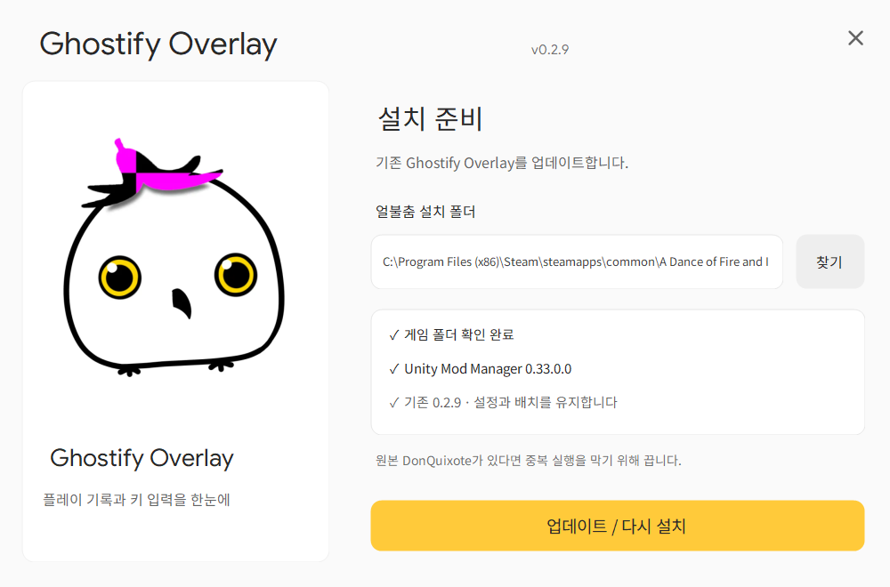

# Ghostify Overlay 설치 프로그램

Windows 10/11용 단일 EXE입니다. .NET Framework 4.8과 **Unity Mod Manager 0.33.0 이상이 설치된 얼불춤**을 사용합니다. 별도 설치 프로그램 패키지나 추가 실행 DLL이 필요하지 않습니다.



실행하면 Steam의 기본·추가 라이브러리에서 게임을 찾습니다. 직접 **찾기**로 게임 폴더를 선택할 수도 있습니다. 게임을 완전히 종료하고 **설치하기 / 업데이트**를 누릅니다. 파일을 쓰는 단계에서 Windows 관리자 권한을 요청합니다.

기존 Ghostify 설정·키 색상·배치·누적 기록은 그대로 유지합니다. 변경 전 모드 전체와 Unity Mod Manager 설정은 `%LocalAppData%\GhostifyOverlay\Backups`에 보관합니다. 성공 화면의 **백업 폴더 열기**로 확인할 수 있습니다. 실패하면 이번 설치가 바꾼 파일과 모드 매니저 설정을 복원합니다. 원본 DonQuixote는 삭제하지 않고 중복 실행을 막기 위해 UMM에서 비활성화합니다. 다른 모드 설정은 유지합니다.

UMM ID/기존 설치 폴더 `DonQuixoteOverlay`는 호환을 위해 유지합니다. 게임 파일이나 Unity Mod Manager DLL은 EXE에 포함하지 않습니다. 배포 모드 12개 파일만 묶고 파일마다 SHA256을 확인합니다. 무결성 해시는 다운로드한 `SHA256SUMS.txt`와 비교할 수 있습니다. EXE에는 코드 서명 인증서가 적용되어 있지 않습니다.

## 이미지와 아이콘

사용자가 제공한 이미지를 `Assets/Mascot.png` 원본 그대로 사용했습니다. 원본 SHA256은 `BBF7EC2CA31A5A694B6377D36B43B17D7E3C64DD7A9305DBC8BC336EA9501A7A`입니다. 아이콘은 이 이미지의 16/24/32/48/64/128/256 크기를 담은 ICO 형식 변환입니다. 그림의 색·형태를 편집하지 않았습니다. 이 이미지는 다른 외부 라이선스 자산으로 간주하지 않습니다.

## 제작과 검사

Visual Studio 2022 Build Tools의 C# compiler와 Windows .NET Framework 4.8을 사용합니다. 설치 UI는 Windows Forms이며 게임 UI는 uGUI/TMP입니다.

```powershell
powershell.exe -NoProfile -ExecutionPolicy Bypass -File Installer\Build-Setup.ps1 -GameDir '게임 폴더'
powershell.exe -NoProfile -ExecutionPolicy Bypass -File Installer\Run-InstallerTests.ps1
```

`dist/GhostifyOverlay-Setup-<버전>.exe`, 모드 ZIP, `SHA256SUMS.txt`를 생성합니다. 검사에서는 실제 InstallerEngine을 컴파일해 새 설치·업데이트·사용자 파일 8개 보존·UMM 보존·두 단계 복원·손상/누락/중복/경로 탈출 ZIP·실행 중 게임 차단 등을 31개 항목으로 확인하고, 배포 EXE 자체의 설치도 별도 임시 게임 폴더에서 실행합니다. 실제 게임 실행과 UAC 사용자 클릭은 이 자동 검사에 포함하지 않습니다.
